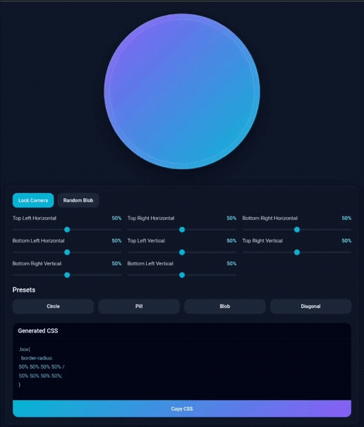

# Border Radius Generator

A modern and interactive Border Radius Generator built using pure HTML, CSS, and JavaScript.

## Features

- Real-time border radius editing
- Lock & unlock all corners together
- Random blob shape generator
- Ready-made presets
  - Circle
  - Pill
  - Blob
  - Diagonal
- Instant CSS code generation
- One-click CSS copy button
- Responsive modern UI
- Smooth live preview updates

## What You Can Do

- Create unique blob shapes
- Generate advanced `border-radius` CSS
- Design rounded UI components
- Experiment with creative shape designs
- Use generated CSS directly in your projects

## Preview

  

## Author

Sahriar Saif

GitHub: https://github.com/sahriarsaif
